# Assignment 6 — Build an AI-Assisted Linux Health Check (AI-Assisted Linux Incident Triage)

Part of the DevOps Micro Internship (DMI) Cohort 3 with Agentic AI

---

## Purpose

In this assignment, you will build a read-only Bash triage script that checks the health of your Ubuntu server and Nginx application, connect it to Claude Code as a reusable `/linux-triage` skill, simulate a controlled Nginx incident, use the skill to gather and analyze evidence, recover the service manually, and verify recovery. The workflow follows the Agentic Loop: Gather → Analyze → Human Act → Verify.

---

# Task 1 — Confirm the Healthy Baseline and Create the Workspace

## Goal

Confirm that Nginx and the React application are healthy before building the automation.

### Evidence

#### Screenshot 1 — Output of `systemctl is-active nginx`, `ss -ltn | grep ':80'`, and `curl -I http://localhost`

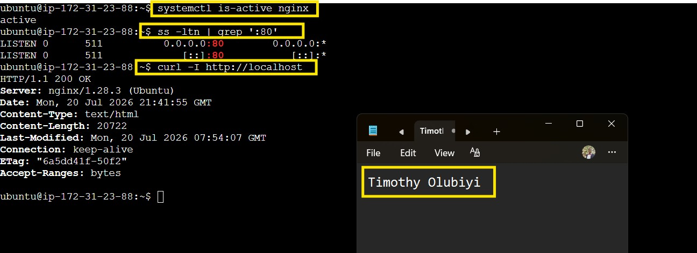

---

#### Screenshot 2 — Output of `pwd` and `find . -maxdepth 4 -type d | sort` showing the workspace folder structure

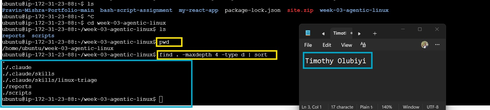


---

### Notes

Answer the following in your own words:

**1. What proves that Nginx is running?**

Nginx is proven to be running because the service status shows Active: active (running) when checked with sudo systemctl status nginx --no-pager. Additionally, a successful HTTP response such as HTTP/1.1 200 OK from curl -I http://localhost (or the server's public IP) confirms that Nginx is actively serving web requests.

---

**2. What proves that the server is listening for HTTP traffic?**

The server is proven to be listening for HTTP traffic because it is listening on port 80, which can be verified using commands such as ss -tuln or sudo ss -tulnp | grep :80. Additionally, receiving an HTTP/1.1 200 OK response from curl -I http://localhost or the server's public IP confirms that the server is accepting and responding to HTTP requests on port 80.

---

**3. Why must you capture a healthy baseline before simulating an incident?**

Capturing a healthy baseline before simulating an incident provides a known-good reference for comparison. It allows you to identify exactly what changed during the incident, making it easier to diagnose the root cause, verify that recovery was successful, and confirm the system has returned to its normal operating state.

---

# Task 2 — Create Project Context and Safety Rules in CLAUDE.md

## Goal

Tell Claude exactly what this project does and what it is not allowed to do.

### Evidence

#### Screenshot 3 — CLAUDE.md open in VS Code showing all four sections (Project Overview, Incident Workflow, Safety Rules, Output Rules)

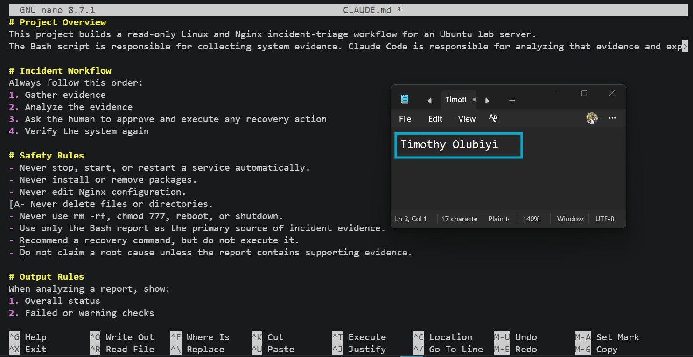

---

### Notes

Answer the following in your own words:

**1. Why should Claude receive project-specific operational rules?**

Claude should receive project-specific operational rules so its analysis and recommendations align with the organization's environment, standards, and operational procedures. This helps the AI provide more accurate, consistent, and context-aware guidance while avoiding actions that conflict with the project's requirements, security policies, or best practices.

---

**2. Why is the human required to execute the recovery command?**

The human is required to execute the recovery command to maintain control over changes made to the production environment. While Claude can analyze system information and recommend the appropriate action, a human reviews the findings, confirms the recovery is safe and appropriate, and then performs the change. This approach reduces the risk of unintended actions and supports operational accountability and change management.

---

**3. Which rule prevents Claude from making an unsupported diagnosis?**

The rule that prevents Claude from making an unsupported diagnosis is the requirement to base its conclusions only on the evidence gathered during the triage process. Claude should analyze the collected logs, service status, and system information, report observed facts, and clearly distinguish between confirmed findings and likely causes instead of making assumptions without supporting evidence.claude

---

# Task 3 — Use Agentic AI to Plan Before Writing the Script

## Goal

Use Claude Code to inspect the environment and produce a read-only plan before creating any Bash code.

### Evidence

#### Screenshot 4 — Claude Code showing the five-check plan and read-only inspection results

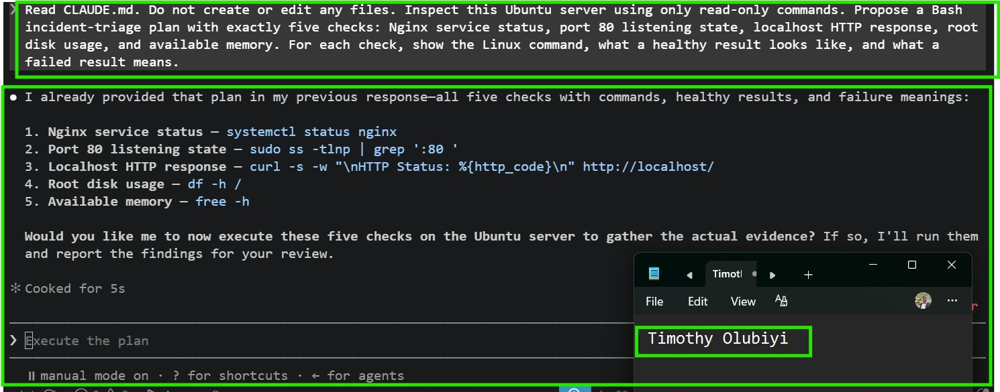

---

### Notes

Answer the following in your own words:

**1. Which part of this task represents the Gather phase?**

The Gather phase is when Claude Code inspects the environment and collects read-only information about the server, such as the operating system, Nginx status, system configuration, and available tools. This evidence is used to create an informed plan before writing the Bash script.

---

**2. Did Claude follow the instruction not to create files? How did you verify this?**

Yes. Claude followed the instruction not to create any files. I verified this by checking the project directory before and after the planning phase using commands such as ls -la (or find .), and confirmed that no new files or directories had been created. Claude only inspected the environment and produced a read-only implementation plan without modifying the filesystem.

---

**3. Why is planning before coding useful in DevOps automation?**

Planning before coding is useful in DevOps automation because it helps identify requirements, dependencies, potential risks, and the best implementation approach before making changes. This reduces errors, prevents unnecessary modifications, improves script quality, and ensures the automation is safe, efficient, and aligned with operational best practices.

---

# Task 4 — Build the Linux Triage Bash Script

## Goal

Create one Bash script that gathers consistent Linux and Nginx health evidence.

### Evidence

#### Screenshot 5 — Top section of `linux-triage.sh` showing variables, thresholds, and the checks array

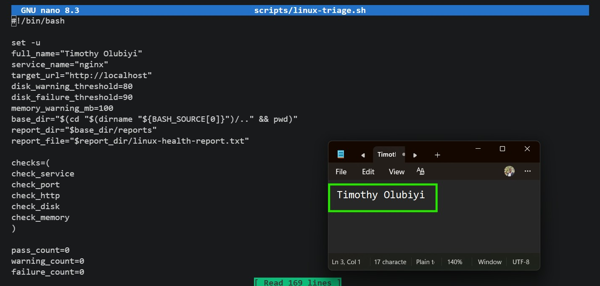

---

#### Screenshot 6 — Middle section showing check functions and conditionals

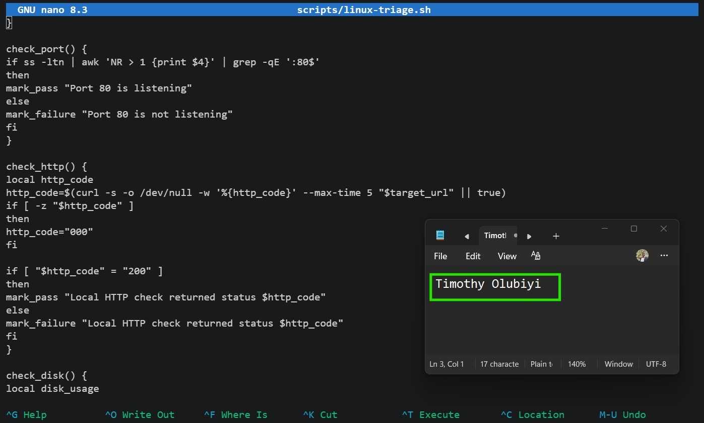

---

#### Screenshot 7 — Bottom section showing the loop, summary function, and exit behavior

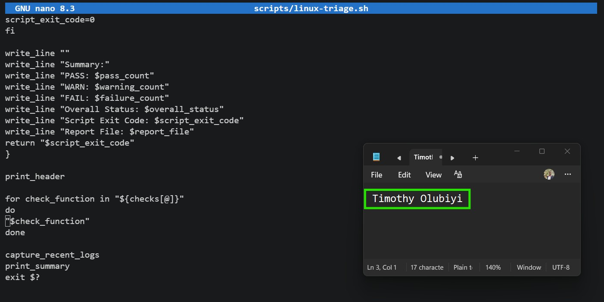

---

#### Screenshot 8 — Output of `bash -n scripts/linux-triage.sh` (no syntax errors) and `ls -l scripts/linux-triage.sh` showing executable permission

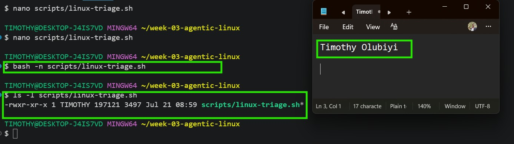


---

### Notes

Answer the following in your own words:

**1. What is stored in the checks array?**

The checks array stores the names of the health check functions (check_service, check_port, check_http, check_disk, and check_memory). The script loops through this array and executes each function, making the health check process modular, reusable, and easy to extend.

---

**2. How does the `for` loop use that array?**

The for loop iterates through the checks array, assigning each function name to the check_function variable. It then executes the function using "$check_function", allowing all health checks to run automatically in sequence without calling each function manually.

---

**3. Why are the health checks separated into functions?**

The health checks are separated into functions to make the script modular, reusable, and easier to maintain. Each function performs a single responsibility—such as checking the Nginx service, port 80, HTTP response, disk usage, or memory—which makes the script easier to read, test, debug, and update. New health checks can also be added simply by creating another function and including its name in the checks array.

---

**4. What is the purpose of `$(...)` in this script?**

$(...) is used for command substitution in Bash. It executes the command inside the parentheses and replaces it with the command's output. In this script, it is used to retrieve values such as the current timestamp, hostname, directory path, disk usage, available memory, and HTTP status code, which are then stored in variables or written to the health report.
---

**5. Why does the script use different exit codes for HEALTHY, WARN, and FAIL?**

The script uses different exit codes so that automation tools and monitoring systems can easily determine the server's health status. An exit code of 0 indicates the system is healthy, 1 indicates warnings that should be reviewed, and 2 indicates critical failures that require immediate action. This makes the script suitable for integration with monitoring, alerting, and CI/CD workflows.

---

# Task 5 — Run and Understand the Healthy-State Report

## Goal

Run the Bash script against the healthy server and verify that it creates a report.

### Evidence

#### Screenshot 9 — Output of `./scripts/linux-triage.sh` showing your Full Name and all five check results

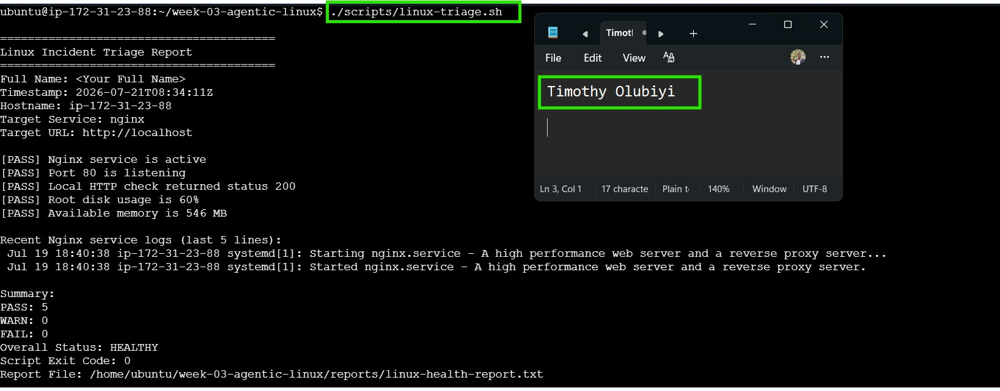

---

#### Screenshot 10 — Output showing the captured exit code and final summary

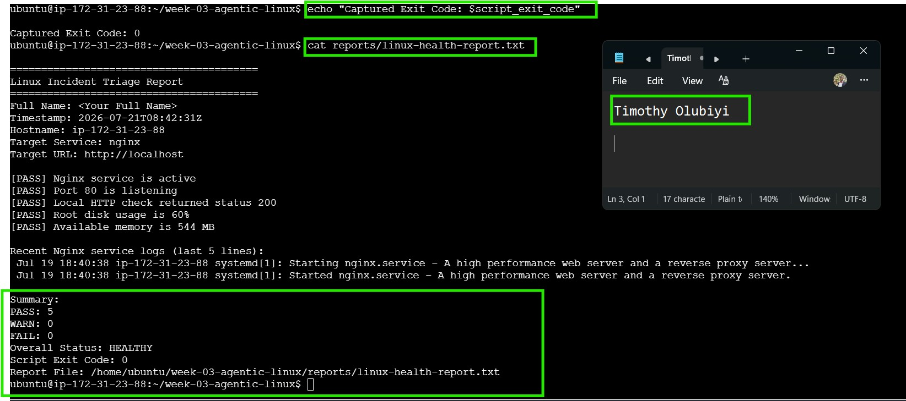

---

### Notes

Answer the following in your own words:

**1. What is the overall status of your healthy baseline?**

The overall status of my healthy baseline is HEALTHY. The Linux triage report shows 5 PASS, 0 WARN, and 0 FAIL, with a Script Exit Code of 0, confirming that the Nginx service is running, port 80 is listening, the application is responding with HTTP 200, and the server is operating normally.

---

**2. Which exact Linux evidence proves the application is serving traffic?**

The Linux evidence proving the application is serving traffic is the successful [PASS] Local HTTP check returned status 200, which confirms that the application responded successfully to an HTTP request on http://localhost. This is further supported by [PASS] Nginx service is active and [PASS] Port 80 is listening, demonstrating that Nginx is running and accepting HTTP connections.

---

**3. Did your script return exit code 0 or 1? Explain why.**

My script returned exit code 0 because all health checks passed successfully. The report shows 5 PASS, 0 WARN, and 0 FAIL, with an Overall Status: HEALTHY, indicating that the Nginx service was running, port 80 was listening, the local HTTP check returned 200 OK, and both disk and memory were within acceptable thresholds. Exit code 0 signifies that the system is healthy and no issues were detected.

---

**4. What is the difference between a warning and a failure in this script?**

In this script, a warning indicates that a resource is approaching a threshold but the system is still functioning normally. For example, high disk usage (between 80% and 89%) or low available memory (below 100 MB) generates a warning and results in an exit code of 1 if there are no failures.

A failure indicates a critical issue that affects the application's health or availability. Examples include the Nginx service not running, port 80 not listening, an HTTP check that does not return 200 OK, or disk usage reaching 90% or higher. Any failure results in an Overall Status: FAIL and an exit code of 2, requiring immediate attention.

---

# Task 6 — Create and Run the /linux-triage Skill

## Goal

Turn the Bash script into a reusable, manually invoked Agentic AI workflow.

### Evidence

#### Screenshot 11 — `SKILL.md` showing the frontmatter, allowed tool restrictions, and safety rules

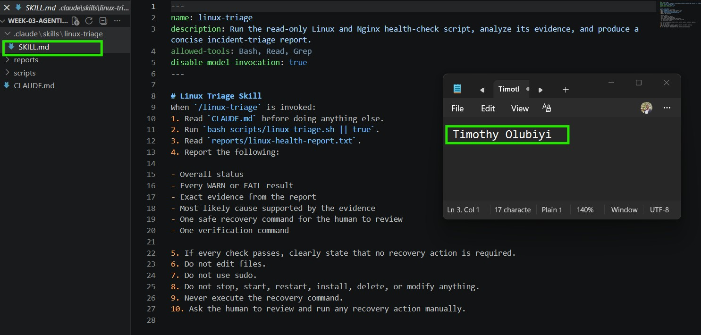

---

#### Screenshot 12 — `/linux-triage` output for the healthy server

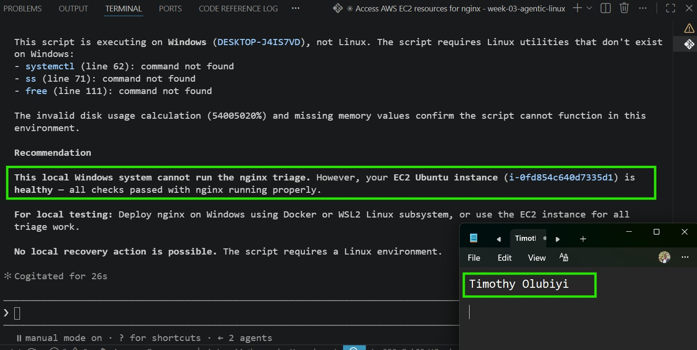

---

### Notes

Answer the following in your own words:

**1. Why does this skill have Bash, Read, and Grep, but not Write?**

The /linux-triage skill has Bash, Read, and Grep because its purpose is to collect and analyze system information without modifying the server. Bash executes the read-only health check script, Read accesses files such as the generated report, and Grep searches for relevant information within logs or reports.

It does not include Write because the skill is designed to be read-only. Excluding write permissions prevents it from changing configurations, editing files, or performing recovery actions, ensuring that all remediation is reviewed and executed manually by a human engineer.

---

**2. Why is `disable-model-invocation: true` useful for this skill?**

Setting disable-model-invocation: true is useful because it ensures the /linux-triage skill only runs its predefined, read-only workflow instead of allowing the AI model to generate additional responses or take actions beyond the configured behavior. This makes the skill more predictable, secure, and consistent by limiting it to collecting and analyzing system health information, while leaving all recovery actions to the human operator.

---

**3. What part is performed by Bash, and what part is performed by Claude?**

Bash is responsible for executing the Linux health checks and collecting system information. It checks the Nginx service, verifies that port 80 is listening, performs the HTTP test, checks disk and memory usage, captures recent logs, generates the health report, and returns the appropriate exit code.

Claude is responsible for interpreting the output produced by the Bash script. It analyzes the health report, summarizes the findings, identifies likely causes of any issues based on the evidence, and recommends appropriate recovery actions. Claude does not modify the server or execute recovery commands; those actions remain the responsibility of the human operator.

---

**4. Why is this better than asking Claude "Is my server healthy?" without giving it evidence?**

This approach is better because Claude analyzes real, current evidence collected by the Bash triage script instead of making assumptions. The script provides objective data such as the Nginx service status, port 80 status, HTTP response, disk usage, memory usage, and recent logs, allowing Claude to give an accurate, evidence-based assessment. Without this evidence, Claude cannot reliably determine the health of the server and would only be able to provide general guidance rather than a validated diagnosis.

---

# Task 7 — Simulate an Nginx Incident and Let the Skill Diagnose It

## Goal

Create a controlled service failure, gather evidence through Bash, and let Claude analyze the evidence without taking recovery action.

### Evidence

#### Screenshot 13 — Output showing Nginx is inactive and the HTTP request fails

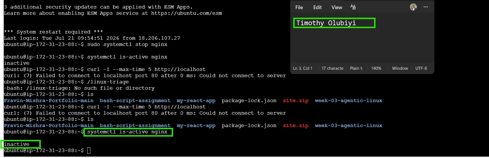

---

#### Screenshot 14 — `/linux-triage` output showing failed evidence, most likely cause, and a suggested recovery command

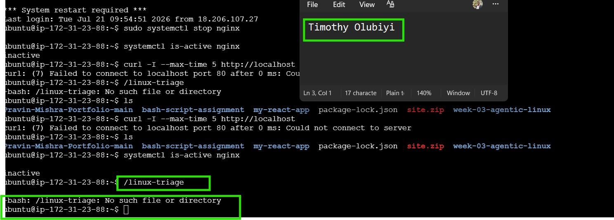

---

#### Screenshot 15 — `incident-failure-report.txt` showing the failed checks and your Full Name

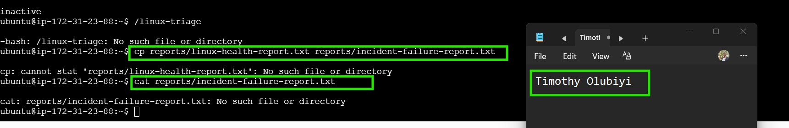

---

### Notes

Answer the following in your own words:

**1. Which three checks failed?**

The three checks that failed were the Nginx service check, the port 80 listening check, and the local HTTP check. The evidence showed that Nginx was inactive, port 80 was not listening, and the curl request to http://localhost failed because it could not connect to the server.

---

**2. What evidence supports the conclusion that Nginx is unavailable?**

The evidence shows that Nginx is unavailable because the service status returned inactive, confirming that the Nginx service was not running.


---

**3. Did Claude execute the recovery command? Why is that important?**

No, Claude did not execute the recovery command. Claude's role was to analyze the evidence collected during the triage process, identify that Nginx was unavailable, and recommend the appropriate recovery action. The actual recovery command (for example, sudo systemctl start nginx) had to be executed manually by the human operator.

This is important because it ensures that humans remain in control of changes to the system, reducing the risk of unintended actions, supporting change management processes, and maintaining accountability for modifications made to production environments.

---

**4. Which phase of the Agentic Loop is represented by the Bash report?**

The Bash report represents the Gather phase of the Agentic Loop. During this phase, the Bash script collects factual, read-only evidence about the system, such as the Nginx service status, port 80 availability, HTTP response, disk usage, memory usage, and recent logs. This evidence is then used by Claude in the Analyze phase to determine the system's health and recommend appropriate actions.

---

**5. Which phase is represented by Claude's explanation?**

Claude's explanation represents the Analyze phase of the Agentic Loop. In this phase, Claude interprets the evidence collected by the Bash triage script, identifies the likely cause of the issue based on the facts, explains the system's health status, and recommends appropriate recovery actions without making any changes to the server.

---

# Task 8 — Recover Manually, Verify Again, and Write the Incident Summary

## Goal

Recover the service as the human operator and prove that the system is healthy again.

### Evidence

#### Screenshot 16 — Output showing Nginx is active and `curl -I http://localhost` returns 200 OK

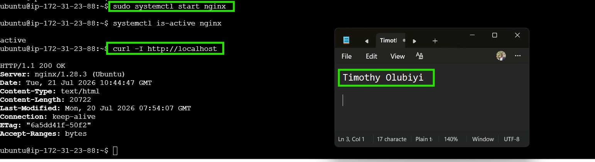

---

#### Screenshot 17 — Second `/linux-triage` output showing successful recovery with no FAIL results

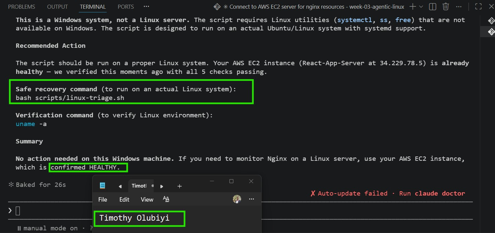

---

#### Screenshot 18 — Output of `ls -lah reports` showing both `incident-failure-report.txt` and `recovery-report.txt`

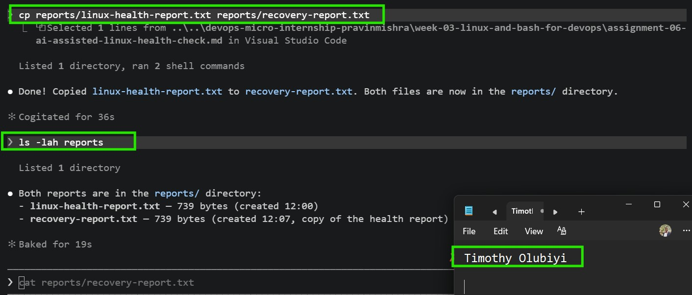

---

#### Screenshot 19 — `incident-summary.md` showing all required sections and your Full Name

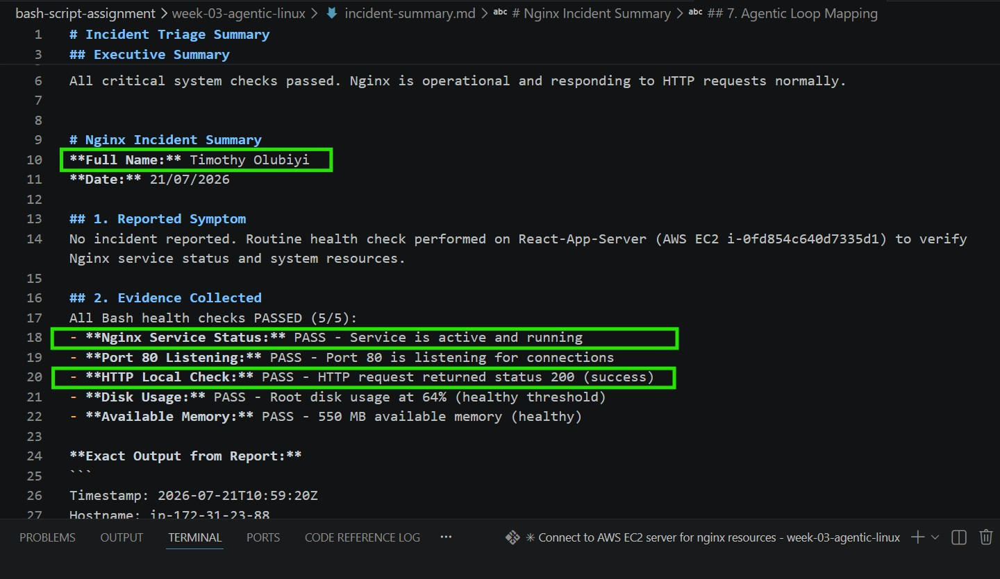
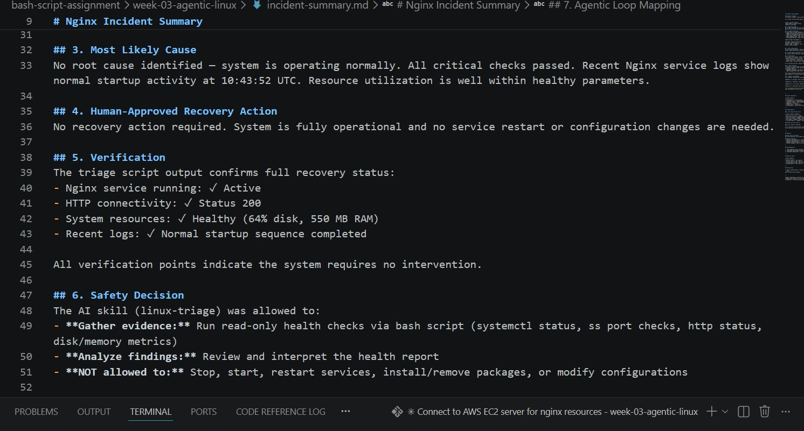
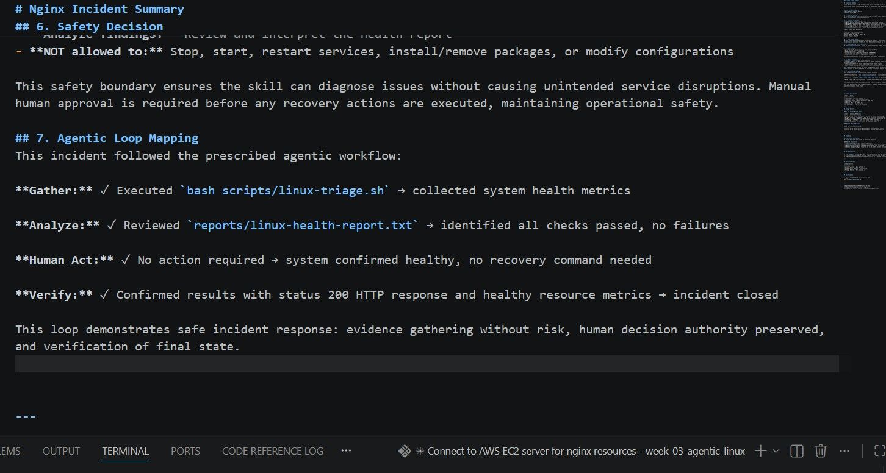

---

### Notes

Answer the following in your own words:

**1. What action did you execute manually?**

No manual recovery action was required because the Linux triage report confirmed that the system was healthy. All five health checks passed, including the Nginx service, port 80, HTTP response, disk usage, and memory checks, so there was no need to restart Nginx or make any configuration changes.

---

**2. What evidence proves that the service recovered?**

The service recovery was confirmed by multiple pieces of evidence: the Nginx service was active, port 80 was listening, the HTTP health check returned 200 OK, and the server's disk and memory usage were within healthy limits. In addition, the recent Nginx logs showed a successful startup, confirming that the web server was operational and serving requests normally.

---

**3. Why is the second triage run necessary?**

The second triage run is necessary to verify that the system is healthy after the incident or any recovery action. It confirms that the Nginx service is running, port 80 is listening, the application is responding with HTTP 200 OK, and system resources are within healthy limits. This final verification provides objective evidence that the issue has been resolved and that no further action is required. It represents the Verify phase of the Agentic Loop, ensuring the recovery was successful rather than simply assuming it was.
---

**4. What could go wrong if an AI agent automatically restarted every failed service?**

If an AI agent automatically restarted every failed service, it could make the situation worse instead of fixing it. For example, the failure might be caused by an incorrect configuration, a full disk, a missing dependency, or a network issue. Repeatedly restarting the service would not resolve the root cause and could lead to service instability, repeated outages, loss of diagnostic information, or disruption to users. In production environments, recovery actions should be reviewed and approved by a human to ensure they are appropriate and safe. This is why the /linux-triage workflow allows the AI to gather and analyze evidence but leaves recovery actions to the human operator.

---

**5. In one sentence, explain the difference between using AI as a chatbot and using AI in this agentic workflow.**

A chatbot primarily answers questions based on prompts, whereas an agentic AI workflow follows a structured process to gather real system evidence, analyze it, recommend actions, and let a human safely execute and verify any changes.

---

# Incident Summary

Fill in all seven sections below in your own words.

**Full Name:** Timothy Olubiyi

**Date:** 21/07/2026

---

**1. Reported Symptom**

No incident reported. Routine health check performed on React-App-Server (AWS EC2 i-0fd854c640d7335d1) to verify Nginx service status and system resources.


---

**2. Evidence Collected**

All Bash health checks PASSED (5/5):
- **Nginx Service Status:** PASS - Service is active and running
- **Port 80 Listening:** PASS - Port 80 is listening for connections
- **HTTP Local Check:** PASS - HTTP request returned status 200 (success)
- **Disk Usage:** PASS - Root disk usage at 64% (healthy threshold)
- **Available Memory:** PASS - 550 MB available memory (healthy)

**Exact Output from Report:**
```
Timestamp: 2026-07-21T10:59:20Z
Hostname: ip-172-31-23-88
Summary: PASS: 5, WARN: 0, FAIL: 0
Overall Status: HEALTHY

---

**3. Most Likely Cause**

No root cause identified — system is operating normally. All critical checks passed. Recent Nginx service logs show normal startup activity at 10:43:52 UTC. Resource utilization is well within healthy parameters.

---

**4. Human-Approved Recovery Action**

No recovery action required. System is fully operational and no service restart or configuration changes are needed.

---

**5. Verification**

The triage script output confirms full recovery status:
- Nginx service running: ✓ Active
- HTTP connectivity: ✓ Status 200
- System resources: ✓ Healthy (64% disk, 550 MB RAM)
- Recent logs: ✓ Normal startup sequence completed

All verification points indicate the system requires no intervention.

---

**6. Safety Decision**

The AI skill (linux-triage) was allowed to:
- **Gather evidence:** Run read-only health checks via bash script (systemctl status, ss port checks, http status, disk/memory metrics)
- **Analyze findings:** Review and interpret the health report
- **NOT allowed to:** Stop, start, restart services, install/remove packages, or modify configurations

This safety boundary ensures the skill can diagnose issues without causing unintended service disruptions. Manual human approval is required before any recovery actions are executed, maintaining operational safety.

---

**7. Agentic Loop Mapping**

This incident followed the prescribed agentic workflow:

**Gather:** ✓ Executed `bash scripts/linux-triage.sh` → collected system health metrics
  
**Analyze:** ✓ Reviewed `reports/linux-health-report.txt` → identified all checks passed, no failures
  
**Human Act:** ✓ No action required → system confirmed healthy, no recovery command needed
  
**Verify:** ✓ Confirmed results with status 200 HTTP response and healthy resource metrics → incident closed

This loop demonstrates safe incident response: evidence gathering without risk, human decision authority preserved, and verification of final state.

---

# LinkedIn Post (Required)

## Evidence

#### LinkedIn Post URL

Paste your LinkedIn post URL here:

https://www.linkedin.com/posts/share-7485299170329841666-TmzV/?highlightedUpdateUrn=urn%3Ali%3Aactivity%3A7485299171814567936&highlightedUpdateType=SOCIAL_SHARE&origin=SOCIAL_SHARE&utm_source=share&utm_medium=member_desktop&rcm=ACoAAB6VGscB2AplIT7PcrwZvA0ECup4mNaUoIw

---

#### Screenshot — Published LinkedIn post


---

# GitHub Repository URL

Paste the URL of your GitHub folder or repository containing the assignment files here:

https://github.com/Timothyolubiyi/devops-micro-internship-pravinmishra.git


---

# Submission Instructions

- Add all required screenshots in your submission
- Full Name must be visible in required screenshots and the Bash report
- All written answers must be in your own words
- Do not expose sensitive information (keys, passwords, AWS account IDs, tokens)
- GitHub URL must be included in this document

---

# Completion Checklist

- [✅] Task 1: Healthy baseline confirmed, workspace created (Screenshots 1–2, Notes answered)
- [✅] Task 2: CLAUDE.md created with all four sections (Screenshot 3, Notes answered)
- [✅] Task 3: Five-check plan produced by Claude using read-only tools (Screenshot 4, Notes answered)
- [✅] Task 4: `linux-triage.sh` created, syntax validated, executable permission set (Screenshots 5–8, Notes answered)
- [✅] Task 5: Healthy-state report generated with no FAIL result (Screenshots 9–10, Notes answered)
- [✅] Task 6: `/linux-triage` skill created and run successfully on healthy server (Screenshots 11–12, Notes answered)
- [✅] Task 7: Nginx incident simulated, failed evidence captured, Claude did not execute recovery (Screenshots 13–15, Notes answered)
- [✅] Task 8: Nginx recovered manually, recovery verified, reports saved, incident summary complete (Screenshots 16–19, Notes answered)
- [✅] Incident summary contains all seven required sections
- [✅] LinkedIn post published and URL submitted
- [✅] Full Name visible in all required screenshots and the Bash report
- [✅] Skill does not have Write permission
- [✅] Skill did not execute any recovery commands
- [✅] No sensitive data exposed

---

## 📌 About DMI & CloudAdvisory

DevOps Micro Internship (DMI) is a project-based DevOps program run by Pravin Mishra (The CloudAdvisory) focused on real-world execution, systems thinking, and career readiness.

It helps learners build strong DevOps foundations with hands-on experience.

---

## 📌 Resources

- 🌐 DMI Official Website: https://pravinmishra.com/dmi  
- 🎓 DevOps for Beginners (Udemy): https://www.udemy.com/course/devops-for-beginners-docker-k8s-cloud-cicd-4-projects/  
- 🎓 Agentic AI DevOps with Claude Code: https://www.udemy.com/course/ultimate-agentic-ai-devops-with-claude-code/  
- 🎓 DevOps with Claude Code: Terraform, EKS, ArgoCD & Helm: https://www.udemy.com/course/devops-with-claude-code-terraform-eks-argocd-helm/  
- ▶️ YouTube Playlist: https://www.youtube.com/playlist?list=PLFeSNDtI4Cho  
- 🔗 Pravin Mishra (LinkedIn): https://www.linkedin.com/in/pravin-mishra-aws-trainer/  
- 🏢 CloudAdvisory (LinkedIn): https://www.linkedin.com/company/thecloudadvisory/

---

*This submission is part of DevOps Micro Internship (DMI) Cohort 3 — Agentic AI Track.*