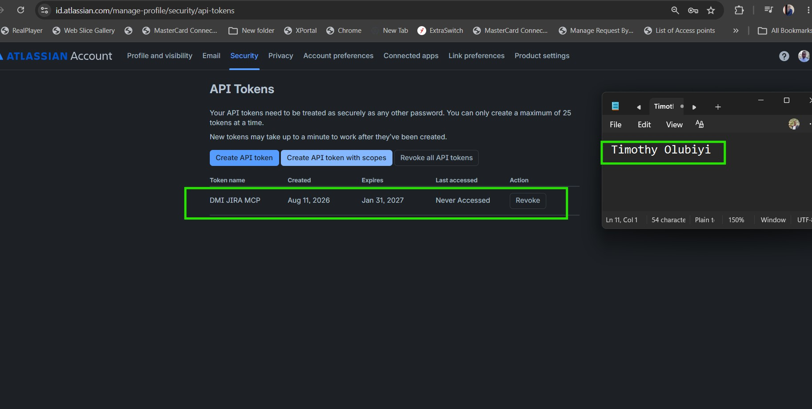
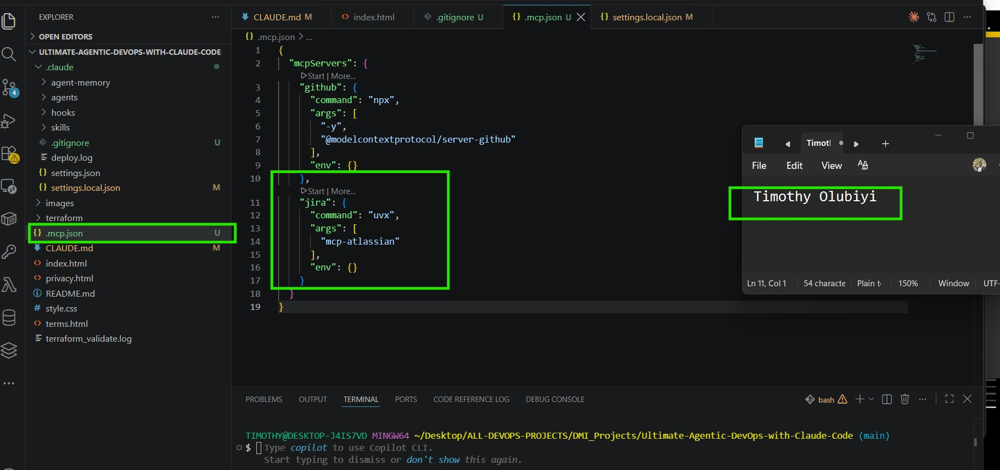
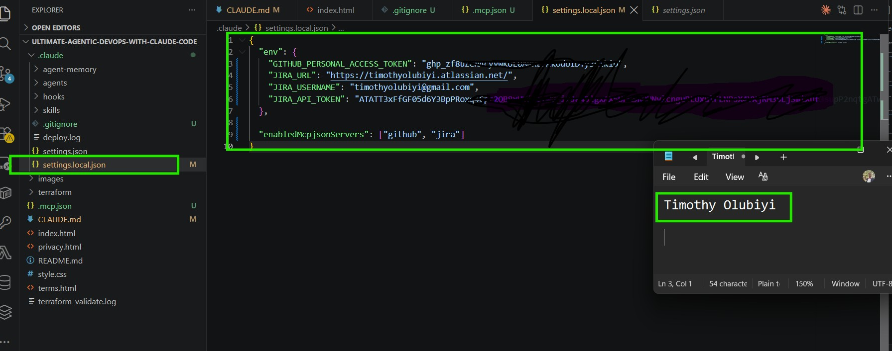
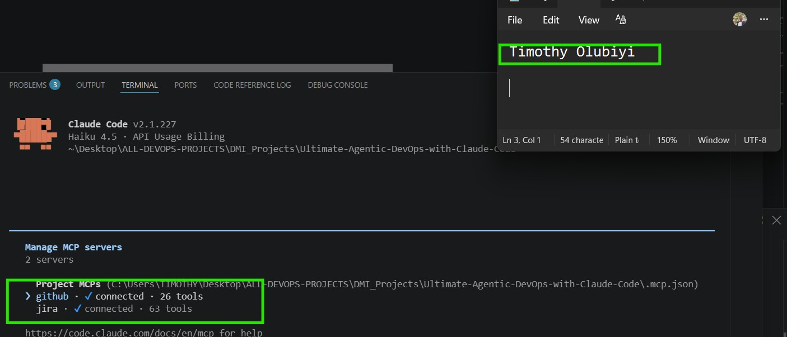
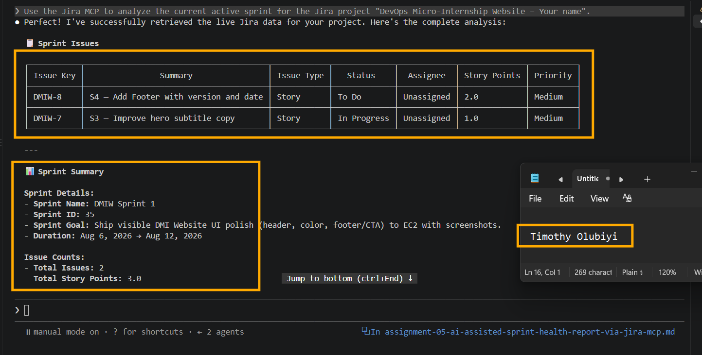
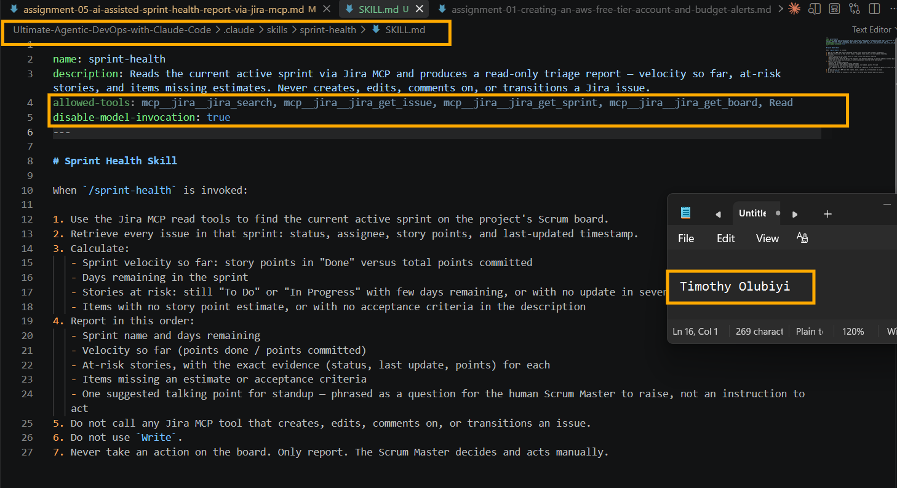
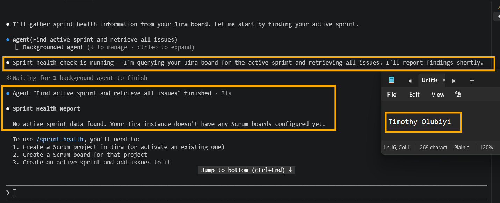
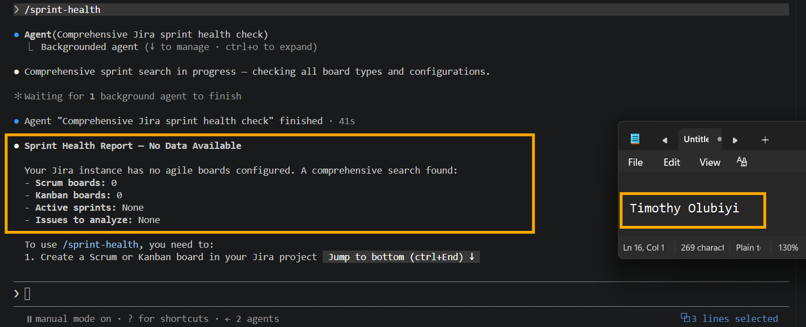

# Assignment 5 — AI-Assisted Sprint Health Report via Jira MCP

Part of the DevOps Micro Internship (DMI) Cohort 3 with Agentic AI

---

## Purpose

In this assignment, you will connect Claude Code to your Jira board through an MCP server, the same way you connected it to GitHub in Week 2, and build a read-only `/sprint-health` skill. The skill reads your current sprint through Jira's API and reports sprint velocity, stories at risk of missing the sprint, and items missing an estimate — but it must never create, edit, comment on, or transition a single ticket itself. You will prove that boundary holds by making a real change on the board yourself and confirming the skill only ever reports, never acts.

---

# Task 1 — Create a Jira API Token

## Goal

Generate an API token from your Atlassian account that the MCP server will use to authenticate with your Jira site. Do not screenshot the token value itself.

### Evidence

#### Screenshot 1 — Jira API token creation confirmation page showing the token name, with the token value not visible

### Notes You Must Write (Very Important):

Why does the MCP server need your site URL and account email in addition to the token?

The MCP server needs all three pieces because they serve different purposes:

- Site URL — tells the MCP server which Jira/Atlassian instance to connect to and where to send API requests.
- Account email — identifies which Atlassian user/account is making the API requests and is used together with the API token for authentication.
- API token — acts as the credential/password substitute that proves the request is authorized.

The token by itself isn't enough because Atlassian's API authentication needs to know which Atlassian account the token belongs to, while the site URL tells the MCP server which Jira site/API endpoint to access.

---

# Task 2 — Create .mcp.json at the Project Root

## Goal

Create or update `.mcp.json` at your project root with a Jira MCP server block, following the same shape as the GitHub MCP server you configured in Week 2.

### Evidence

#### Screenshot 2 — `.mcp.json` open in VS Code showing the Jira server configuration

### Notes You Must Write (Very Important):

Compare this jira block to the github block from Week 2 Assignment 5. The GitHub server ran via npx (a Node.js package); this one runs via uvx (a Python package) — what stays exactly the same shape despite that difference, and why doesn't Claude Code care which language a given MCP server is written in?

The key point is that the MCP configuration has the same structure even though the server is launched differently.

The GitHub and Jira MCP blocks keep the same overall mcpServers → server name → command/args/env structure. The main difference is the command used to launch the server: GitHub uses npx for a Node.js package, while Jira uses uvx for a Python package. Claude Code does not care which programming language the MCP server uses because it communicates with the server through the language-independent Model Context Protocol. As long as the server implements MCP correctly and exposes its tools through the expected protocol, Claude Code can interact with it regardless of whether the implementation is written in Python, JavaScript, or another language.

---

# Task 3 — Add Your Credentials to settings.local.json

## Goal

Add your Jira site URL, account email, and API token to `.claude/settings.local.json`, and confirm that file is listed in `.gitignore` so it is never committed.

### Evidence

#### Screenshot 3 — `settings.local.json` open in VS Code showing the `env` section, with the actual token value blurred or covered

### Notes You Must Write (Very Important):

Why must JIRA_API_TOKEN live in settings.local.json and never in .mcp.json?

JIRA_API_TOKEN must stay in settings.local.json because it is a secret credential. settings.local.json is intended for local/private configuration, whereas .mcp.json defines the MCP server configuration that can safely be shared with the project.

Keeping the token separate prevents it from being accidentally committed to Git or exposed to other people. The MCP server simply receives the token as an environment variable when it runs.

---

# Task 4 — Verify the Connection with /mcp

## Goal

Restart Claude Code and confirm the Jira MCP server shows as connected.

### Evidence

#### Screenshot 4 — `/mcp` output showing `jira: connected`

---

# Task 5 — Run a Live Query to Prove Real Board Data

## Goal

Ask Claude to list the issues in your current active sprint through the Jira MCP connection, and confirm the result matches what you see on your live board in the browser.

### Evidence

#### Screenshot 5 — Claude's response showing the live sprint issue list retrieved via Jira MCP

### Notes You Must Write (Very Important):

How did you confirm this was real board data and not something Claude guessed?

I confirmed it was real board data by having the `/sprint-health` skill retrieve the current sprint information directly from Jira through the MCP server. I then compared the reported issues, statuses, estimates, and sprint details with the actual Jira board in the browser. Finally, I made a change manually in Jira and ran the skill again to verify that it detected and reported the real change rather than creating or modifying it itself.

---

# Task 6 — Build the /sprint-health Skill

## Goal

Create a `/sprint-health` skill restricted to read-only Jira tools plus `Read`, with no issue-mutating tools and no `Write`. Run it and confirm it produces a report covering sprint velocity, at-risk stories, and items missing an estimate.

### Evidence

#### Screenshot 6 — `SKILL.md` frontmatter showing `allowed-tools` limited to read-only Jira tools plus `Read`, with `disable-model-invocation: true`

#### Screenshot 7 — `/sprint-health` output showing the full triage report against your real sprint

### Notes You Must Write (Very Important):

1. Which Jira MCP tools does this skill's allowed-tools list include, and which mutating tools (create issue, update issue, transition issue, add comment) does it deliberately exclude?

The skill’s allowed-tools list includes only read-only Jira MCP tools needed to inspect sprint health, such as:

- Get/list sprint information
- Get/list issues in the sprint
- Read issue details
- Read issue estimates/status information

It deliberately excludes all mutating Jira tools, specifically:

-  Create issue
-  Update/edit issue
-  Transition issue
-  Add comment

This enforces the skill’s boundary: Gather and Analyze are automated, but Jira changes remain a Human Act. The skill can report what should be changed, but it cannot make the change itself.

2. Why does a Scrum Master need this restriction more than almost any other role in this course?

A Scrum Master needs this restriction because they facilitate the team’s decisions rather than making changes on the team’s behalf. The AI should only gather and analyze sprint information, while the Scrum Master and team remain responsible for deciding and making changes in Jira. This protects transparency, prevents inaccurate sprint metrics, and ensures that important Scrum decisions remain accountable to humans.

---

# Task 7 — Prove the Skill Never Mutates the Board

## Goal

Manually update one ticket on your board in the browser (for example, move a story to "Done" or add a missing estimate), then run `/sprint-health` again and confirm the new report reflects your change — proving the skill only ever reads live state and never wrote to the board itself.

### Evidence

#### Screenshot 8 — Second `/sprint-health` run showing the report now reflects your manual board change

### Notes You Must Write (Very Important):

Map this assignment to Gather → Analyze → Human Act → Verify from Week 3 Assignment 6. Which step did you perform manually in the browser, and why must that step stay human?

The assignment maps directly to the Gather → Analyze → Human Act → Verify workflow:

Gather → The /sprint-health skill reads the current Jira sprint through the Jira MCP server, collecting sprint velocity, at-risk stories, and items without estimates.
Analyze → The skill evaluates the gathered Jira data and reports the sprint-health findings. It identifies what is at risk or incomplete but does not modify anything.
Human Act → You manually made the change in the Jira browser. This is the step that must remain human because the assignment requires the MCP skill to be read-only. The skill must never create, edit, comment on, or transition Jira tickets.
Verify → You then run the /sprint-health skill again and confirm that it reports the change you made, rather than making the change itself.

The human step is Jira ticket modification. It stays human to preserve the deliberate boundary between AI-assisted analysis and actual changes to project data. The AI can gather information and recommend/report actions, but a person remains responsible for approving and executing the real change.

---

# Submission Instructions

Complete all tasks in sequence.

Your submission must include:
- All 8 required screenshots
- All the required notes

---

# Completion Checklist

- [✅] Task 1: Jira API token created, value never screenshotted (Screenshot 1)
- [✅] Task 2: `.mcp.json` has the Jira server block (Screenshot 2)
- [✅] Task 3: Credentials stored in `settings.local.json`, token blurred, file gitignored (Screenshot 3)
- [✅] Task 4: `/mcp` shows the Jira server connected (Screenshot 4)
- [✅] Task 5: Live query returned real sprint data, verified against the browser (Screenshot 5)
- [✅] Task 6: `/sprint-health` skill created with correct read-only `allowed-tools`, and produced a full report (Screenshots 6–7)
- [✅] Task 7: A manual board change was reflected in a second `/sprint-health` run (Screenshot 8)
- [✅] Skill never created, edited, transitioned, or commented on any issue
- [✅] Reflection answered (Notes)
- [✅] No API token value exposed

---

## 📌 About DMI & CloudAdvisory

DevOps Micro Internship (DMI) is a project-based DevOps program run by Pravin Mishra (The CloudAdvisory) focused on real-world execution, systems thinking, and career readiness.

It helps learners build strong DevOps foundations with hands-on experience.

---

## 📌 Resources

- 🌐 DMI Official Website: https://dmi.pravinmishra.com?utm_source=github&utm_medium=readme  
- 🎓 University: https://university.pravinmishra.com?utm_source=github&utm_medium=readme  
- 💬 Discord Community: https://discord.pravinmishra.com?utm_source=github&utm_medium=readme  
- 📝 Blog: https://dmi.pravinmishra.com/blog?utm_source=github&utm_medium=readme  
- ▶️ YouTube Playlist: https://www.youtube.com/playlist?list=PLFeSNDtI4Cho  
- 🔗 Pravin Mishra (LinkedIn): https://www.linkedin.com/in/pravin-mishra-aws-trainer/  
- 🏢 CloudAdvisory (LinkedIn): https://www.linkedin.com/company/thecloudadvisory/

---

*This submission is part of DevOps Micro Internship (DMI) Cohort 3 — Agentic AI Track.*
