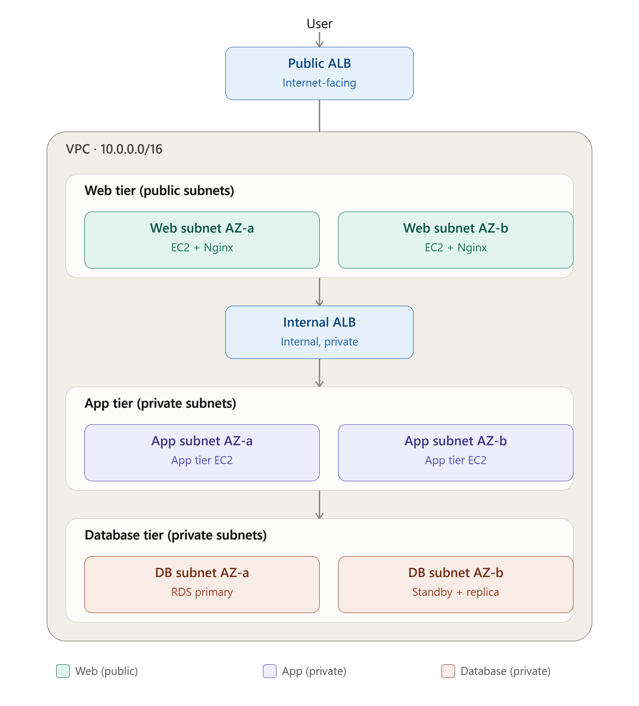
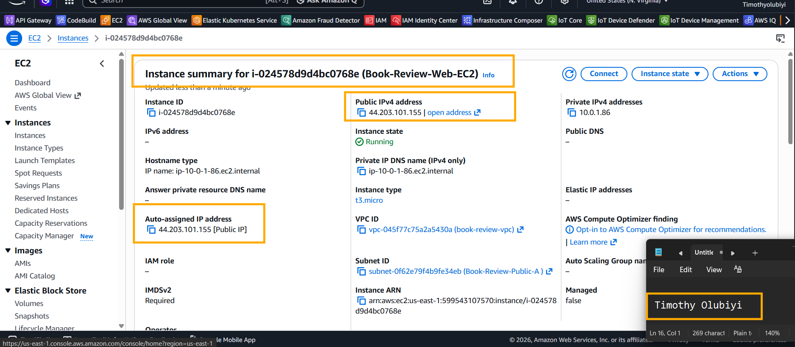
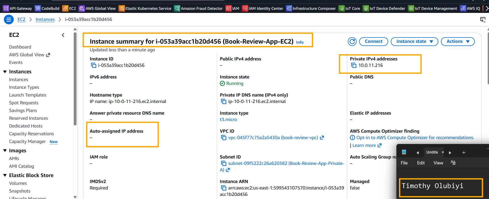
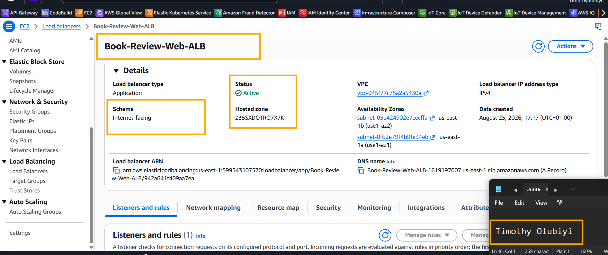
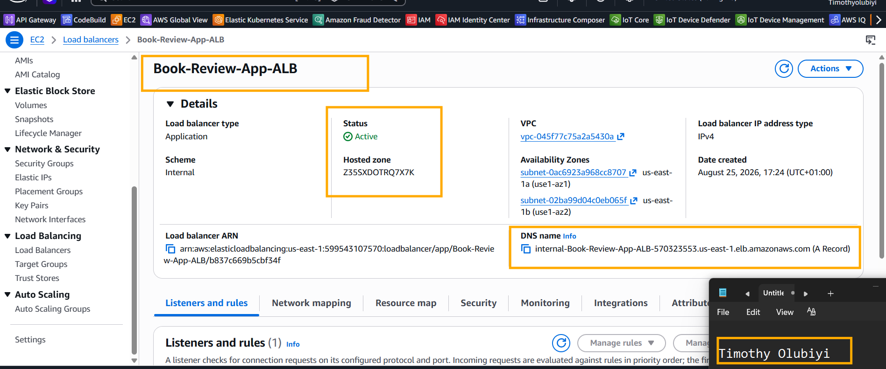
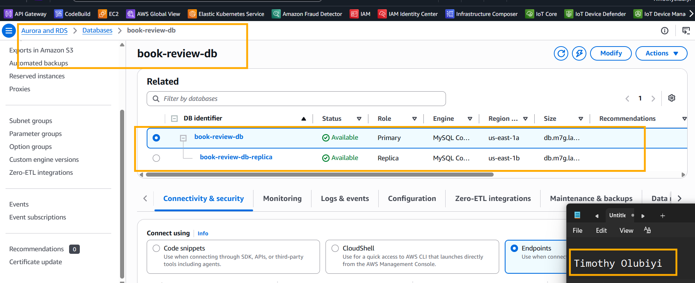
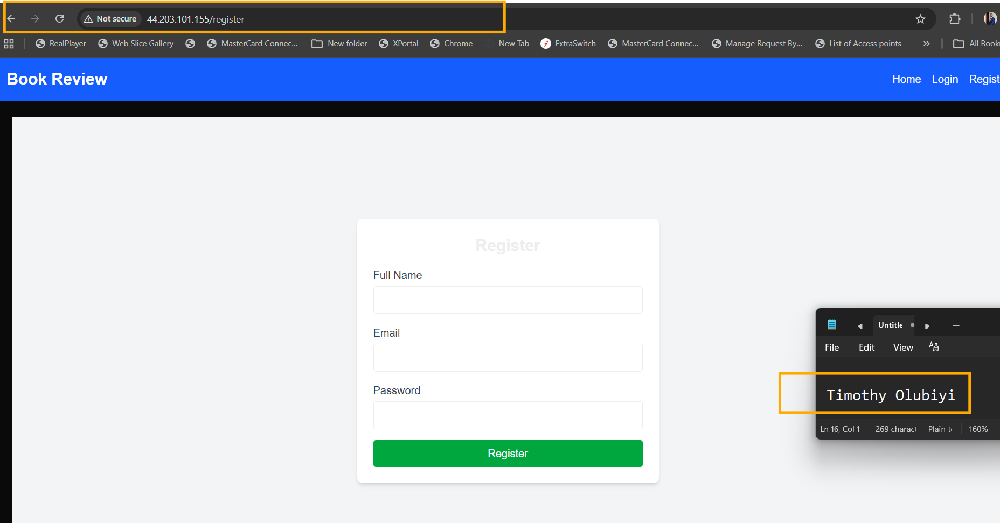
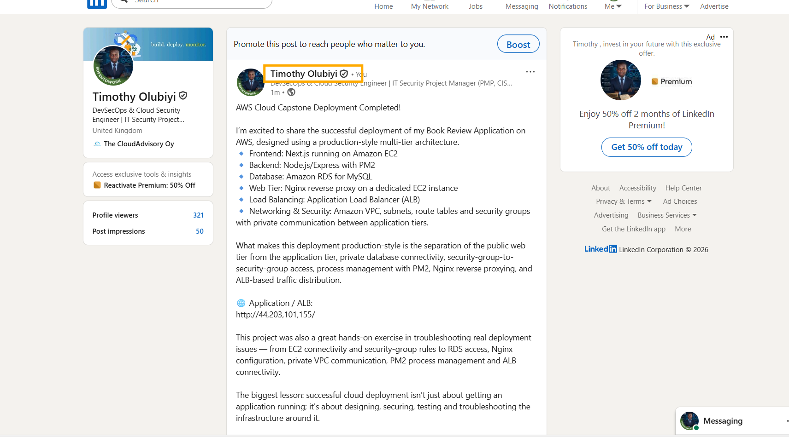

# Assignment 6 — Capstone Assignment — Deploy Book Review App (Three-Tier Architecture) on AWS

Part of the DevOps Micro Internship (DMI) Cohort 3 with Agentic AI

---

## Purpose

This is the most important assignment of the course. You will deploy the Book Review App in a fully production-style three-tier architecture on AWS: a Next.js Web Tier behind Nginx and a public ALB, a private Node.js/Express App Tier behind an internal ALB, and a private Multi-AZ MySQL RDS database with a read replica. You are expected to design, deploy, isolate, debug, and document the result independently.

---

# Task 1 — Architecture Diagram

## Goal

Create an architecture diagram showing the custom VPC (10.0.0.0/16), the six subnets across two Availability Zones (two public Web Tier, two private App Tier, two private Database Tier), the public ALB, Web Tier EC2/Nginx, internal ALB, private App Tier EC2, private Multi-AZ RDS with its read replica, and the permitted traffic flow.

### Evidence

#### Diagram image or link

---

# Task 2 — AWS Region & Services Used

## Goal

Record the AWS Region used and list every AWS service used across networking, compute, load balancing, security, and the database.

### Notes

**Region:**

Region: us-east-1 — US East (N. Virginia)

---

**Services:**

Networking - Amazon VPC - Provides the isolated network environment
            - Subnets - Separates resources into network segments 
            - Internet Gateway - Provides Internet connectivity for the public Web EC2 subnet
            - Route Tables - Controls traffic between subnets, VPC, and Internet
            - Network ACLs - Subnet-level traffic filtering
            - Elastic IP / Public IPv4 - Public Internet access to the Web EC2
Compute   - Amazon EC2 - Hosts the web/reverse-proxy and application servers
          - EC2 Security Groups - Instance-level firewall controls
Load Balancing - Application Load Balancer (ALB) - Public entry point and distributes HTTP/HTTPS traffic to the Web EC2
               - Target Groups - Registers and health-checks the EC2 target behind the ALB

Database  - Amazon RDS for MySQL - Managed relational database for the Book Review application
          - RDS Security Group - Restricts MySQL 3306 access to authorized application resources

---

# Task 3 — Public Entry Point

## Goal

Confirm the Book Review App loads through the public ALB DNS name.

### Evidence

#### Public ALB DNS

Paste your public ALB DNS name here:

http://Book-Review-Web-ALB-1619197007.us-east-1.elb.amazonaws.com

---

# Task 4 — Evidence Screenshots

## Goal

Capture visual proof of every tier and load balancer.

### Evidence

#### Web EC2

---

#### App EC2

---

#### Public ALB

---

#### Internal ALB

---

#### RDS + Replica

---

#### App UI proof

---

# Task 5 — Summary

## Goal

Summarize what worked in the final deployment, the issues encountered and how each was fixed, and the tools or sources used to research and debug.

### Notes

**What worked:**

The Book Review application was successfully deployed using a two-tier EC2 architecture with Amazon RDS MySQL, fronted by Nginx and an Application Load Balancer.

AWS Region: us-east-1 — US East (N. Virginia)

---

**Issues + fixes:**

Issues Encountered and Fixes
#	Issue	                           Diagnosis	                                                           Fix
1	Could not SSH to Web EC2	| SSH access was restricted to a changing local DHCP IP |	Updated the security-group rule to allow the appropriate current source IP/administrative access

2	Security-group rules appeared conflicting around ports	| Web/App traffic rules were being confused with SSH rules	| Separated SSH 22 from application traffic such as 3001; used SG-to-SG rules for internal communication

3	EC2 could not initially connect to RDS	| ERROR 2003 ... (110) indicated a network timeout, not bad credentials	| Allowed MySQL 3306 in the RDS SG from the application EC2 security group

4	Database authentication appeared to fail | Connection was timing out before authentication	| Confirmed networking first; once 3306 was permitted, MySQL login worked

5	Application could not be reached using an incorrect public IP	| The App EC2 had no public IPv4 address	| Identified that 10.0.11.216 was the private App EC2; used the actual Web EC2 public IP

6	Web EC2 public IP initially failed	| Web EC2 had no service listening on port 80	| Installed and enabled Nginx on the Web EC2

7	App EC2 was serving both application and Nginx traffic | Nginx had been configured on the App EC2 rather than the intended Web EC2	| Moved the public reverse-proxy role to the Web EC2

8	Web EC2 could not initially reach the application	| Needed to verify private connectivity/security-group access	| Tested Web EC2 → App EC2 using private IP 10.0.11.216; confirmed connectivity

9	Nginx showed the default page instead of the application	| Default Nginx configuration was serving /var/www/html	| Reconfigured Nginx as a reverse proxy

10	/api/books needed to reach Express	| Backend was running on App EC2 port 3001	| Configured Nginx /api/ to proxy to 10.0.11.216:3001

11	Frontend needed to reach Next.js	| Next.js was running on App EC2 port 3000	| Configured Nginx / to proxy to 10.0.11.216:3000

12	PM2 backend initially showed errored	| Backend process had failed repeatedly	| Investigated the running processes and verified the backend was eventually responding successfully on 3001

13	Application processes needed persistence	| Services could otherwise disappear after reboot	| Used PM2 save and configured PM2 startup with systemd

14	ALB access required target/network verification |	Public ALB access depends on listener, target group, health checks and SG rules | 	Used the ALB → Target Group → Web EC2 architecture and verified connectivity through each layer

---

**Tools/sources used:**

1. Used to test HTTP connectivity at every layer:

curl -i http://localhost
curl -i http://localhost:3001/api/books
curl -i http://10.0.11.216:3001/api/books

2. nc / netcat

Used to test TCP connectivity:

3. nc -vz <rds-endpoint> 3306

Used to identify listening ports:

4. sudo ss -lntp

This was especially useful for proving:

Nginx → :80
Next.js → :3000
Express → :3001

5. ip route

Used to inspect routing.

6. systemctl

Used to verify services:

sudo systemctl status nginx
systemctl is-enabled pm2-ubuntu

7. PM2

Used for Node.js process management:

pm2 status
pm2 restart frontend
pm2 save
pm2 startup

8. Nginx

Used as the reverse proxy between the public Web EC2 and private App EC2.

9. Windows Connectivity Testing

From the Windows workstation, I used:

Test-NetConnection <IP> -Port 80

---

# LinkedIn Post (Required)

## Goal

Publish a LinkedIn post sharing the capstone deployment, including the public ALB DNS (or a redacted screenshot), three to five lines on what you built and why it is production-style, and one proof screenshot.

## Evidence

#### LinkedIn Post URL

Paste your LinkedIn post URL here:

https://lnkd.in/p/etFMSW2t

---

#### Screenshot of LinkedIn post

---

# Submission Instructions

- Add all required screenshots and links in your submission
- Do not expose passwords, RDS credentials, connection strings, private keys, or account IDs

---

# Completion Checklist

- [✅] Task 1: Architecture diagram completed
- [✅] Task 2: AWS Region and services documented
- [✅] Task 3: Public ALB DNS confirmed working
- [✅] Task 4: All six evidence screenshots captured (Web Tier, App Tier, both ALBs, RDS + replica, app UI)
- [✅] Task 5: Deployment summary completed (what worked, issues/fixes, tools/sources)
- [✅] LinkedIn post published and URL submitted
- [✅] App Tier and Database Tier confirmed not publicly accessible
- [✅] No sensitive data exposed

---

## 📌 About DMI & CloudAdvisory

DevOps Micro Internship (DMI) is a project-based DevOps program run by Pravin Mishra (The CloudAdvisory) focused on real-world execution, systems thinking, and career readiness.

It helps learners build strong DevOps foundations with hands-on experience.

---

## 📌 Resources

- 🌐 DMI Official Website: https://dmi.pravinmishra.com?utm_source=github&utm_medium=readme  
- 🎓 University: https://university.pravinmishra.com?utm_source=github&utm_medium=readme  
- 💬 Discord Community: https://discord.pravinmishra.com?utm_source=github&utm_medium=readme  
- 📝 Blog: https://dmi.pravinmishra.com/blog?utm_source=github&utm_medium=readme  
- ▶️ YouTube Playlist: https://www.youtube.com/playlist?list=PLFeSNDtI4Cho  
- 🔗 Pravin Mishra (LinkedIn): https://www.linkedin.com/in/pravin-mishra-aws-trainer/  
- 🏢 CloudAdvisory (LinkedIn): https://www.linkedin.com/company/thecloudadvisory/

---

*This submission is part of DevOps Micro Internship (DMI) Cohort 3 — Agentic AI Track.*