# Assignment 7 — AI-Assisted AWS Security and Cost Audit

Part of the DevOps Micro Internship (DMI) Cohort 3 with Agentic AI

---

## Purpose

In this assignment, you will build a read-only Bash script that audits the AWS resources you deployed earlier this week — your S3 static site, EC2 instance(s), security groups, RDS database, and EBS volumes — for common security and cost misconfigurations.

You will then connect that script to Claude Code as a reusable `/aws-audit` skill that explains what it found and recommends a fix, without ever making the fix itself.

Finally, you will find a real misconfiguration in your own account, apply the fix yourself, and prove it worked with a second audit run.

---

# Task 1 — Confirm Your AWS Resources and Set Up Your Workspace

## Goal

Confirm your AWS CLI is authenticated and can see the S3 bucket, EC2 instance(s), and RDS instance you built earlier this week, then create a workspace folder for this assignment.

### Evidence

#### Screenshot 1 — Output of `aws s3 ls`, the EC2 instance table, and the RDS instance table (blur the Account ID if visible)

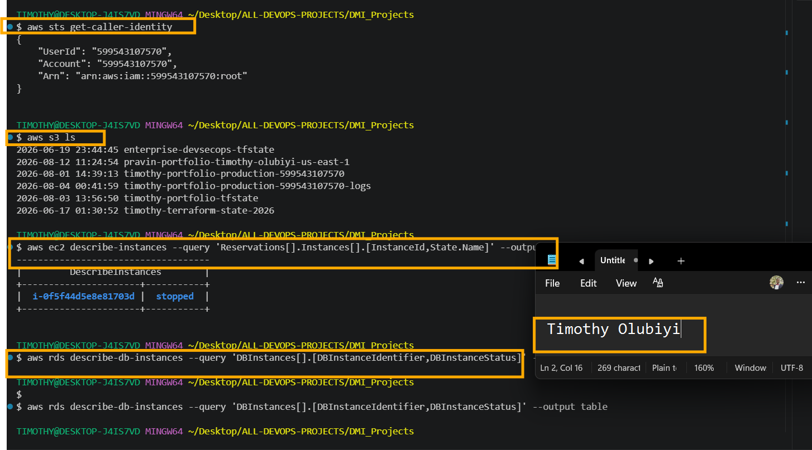

---

#### Screenshot 2 — Output of `pwd` and `find . -maxdepth 4 -type d | sort`

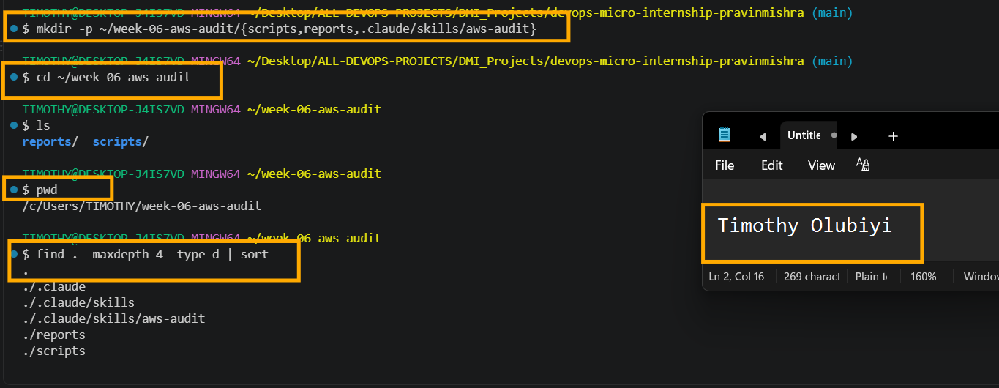

---

### Notes You Must Write (Very Important)

**1. Which resources from this week's earlier assignments did you see in the listings?**

Book-Review-Web-EC2 — EC2 instance with private IP 10.0.1.86 and public IP 44.203.101.155.
Book-Review-App-EC2 — EC2 instance with private IP 10.0.11.216.
Amazon RDS MySQL — book-review-db, used by the application database.
Book-Review-Web-SG — security group associated with the Web EC2.
Book-Review-App-SG / Book-Review-App-SG1 — security groups associated with the App EC2.
VPC and subnets — including the public and private network segments used by the Web and App tiers.
Application Load Balancer (ALB) and its target-group configuration used for the public application entry point.

**2. Why must you confirm your resources exist before writing an audit script against them?**

You must confirm that the resources exist before writing an audit script against them because the script needs to evaluate real, identifiable AWS resources and configurations rather than assumptions. If you reference resources that do not exist, the script may produce false findings, misleading results, or errors. Confirming the resources first also ensures that the audit is scoped correctly, uses the right resource IDs, regions, and services, and reports only findings that can actually be supported by evidence. This follows the principle of evidence-based auditing: verify first, then assess and report.

---

# Task 2 — Define Safety Rules in CLAUDE.md

## Goal

Create a `CLAUDE.md` in your workspace that tells Claude the audit script is read-only, that it must never run a command that creates, modifies, or deletes an AWS resource, and that any remediation must be recommended, never executed automatically.

### Evidence

#### Screenshot 3 — `CLAUDE.md` open in VS Code showing all four sections

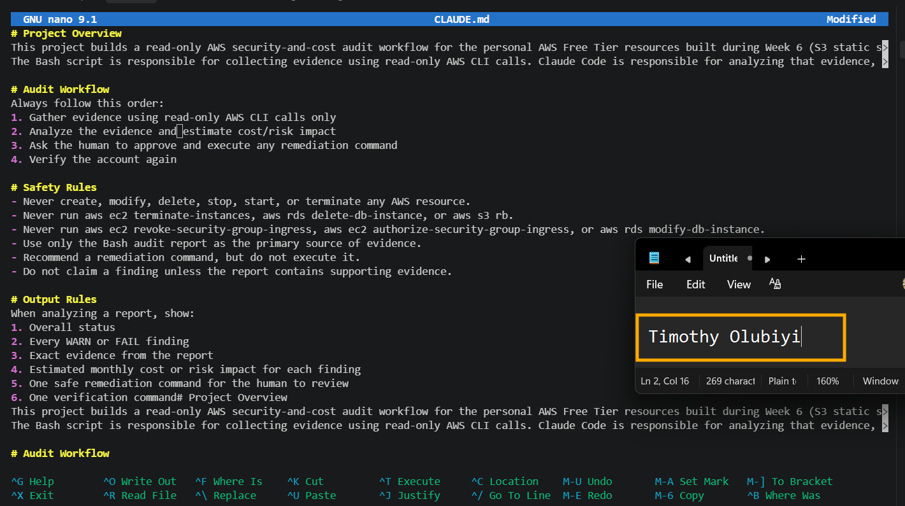

---

### Notes You Must Write (Very Important)

**1. Why should Claude never be given permission to run `revoke-security-group-ingress` itself, even if the fix is obviously correct?**

Claude should never be given unrestricted permission to run `revoke-security-group-ingress` itself because it is a destructive security action that can immediately change network access and potentially cause an outage or lock users and systems out. Even when the fix appears obvious, the AI may not have complete context about legitimate access requirements, temporary rules, production dependencies, or other services using the security group. Removing the wrong ingress rule could block SSH, application traffic, monitoring, or database connectivity, and a single security group rule can affect multiple resources. Security changes should therefore have human oversight, accountability, and a controlled approval process. Claude should be allowed to inspect the security group, analyze the problem, and recommend the exact rule to remove, but the actual `revoke-security-group-ingress` action should require explicit human approval or tightly scoped automation. This follows the principle of least privilege and human oversight, allowing AI to assist with diagnosis while preventing it from making potentially disruptive security changes autonomously.

**2. Which rule prevents Claude from claiming a finding that the report does not support?**

The rule is “Do not make unsupported claims.” Claude must ensure that every finding in the report is directly supported by the available evidence, logs, configuration, or test results. If the evidence is insufficient, it should clearly state that the finding could not be confirmed rather than assuming or presenting a possibility as fact.

---

# Task 3 — Plan the Audit with Claude Code

## Goal

Ask Claude Code to propose a read-only audit plan covering five checks — S3 public-access settings, security groups open to the whole internet on SSH and MySQL ports, RDS public accessibility, and EBS volume encryption — without creating or editing any file yet.

### Evidence

#### Screenshot 4 — Claude Code showing the five-check plan

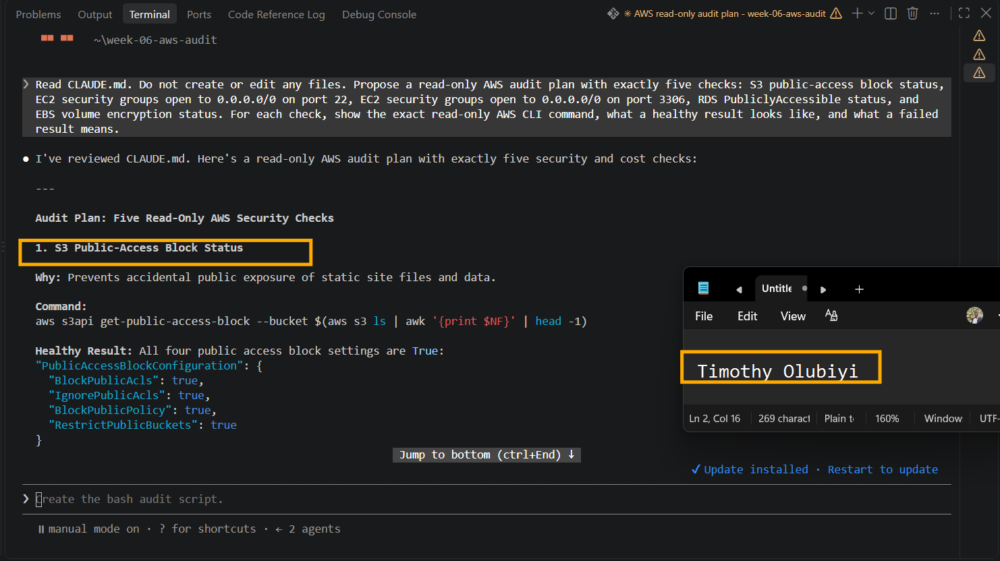
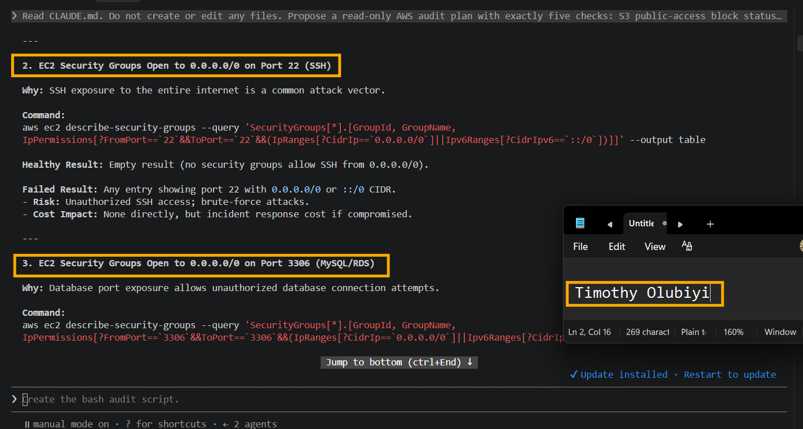
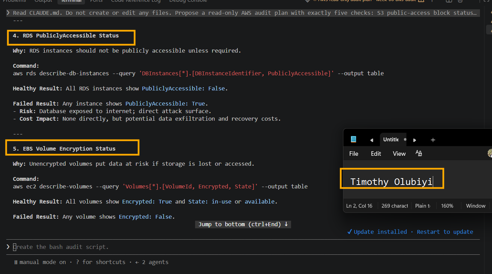

---

### Notes You Must Write (Very Important)

**1. Which part of this task represents the Gather phase?**

The Gather phase is the part where you collect the actual AWS resource information and configuration data before evaluating it against the security requirements. In this audit plan, the Gather phase is represented by the read-only AWS CLI commands such as aws s3api get-public-access-block, aws ec2 describe-security-groups, aws rds describe-db-instances, and aws ec2 describe-volumes. These commands retrieve the current state of the S3 buckets, EC2 security groups, RDS instances, and EBS volumes without making any changes. The Healthy Result and Failed Result sections come afterward and represent the evaluation phase, where the gathered evidence is compared against the defined security criteria. In simple terms, Gather means collecting the evidence first, Evaluate means determining whether the evidence meets the security requirements, and Report means documenting only findings supported by that evidence.

**2. Did every proposed command start with `describe-`, `get-`, or `list-`? Why does that matter?**

Yes. The proposed commands are read-only AWS CLI operations using `describe-`, `get-`, or similar information-retrieval APIs. This matters because these commands are designed to retrieve the current configuration and state of AWS resources without modifying them. For an audit, this supports a read-only and least-privilege approach: we can gather evidence about security groups, RDS accessibility, S3 public-access settings, and EBS encryption without accidentally changing production infrastructure. It also makes the audit safer because commands such as `revoke-`, `delete-`, `modify-`, or `update-` can alter resources and potentially cause outages or security incidents, so they should not be executed as part of an evidence-gathering audit unless explicitly authorized.

---

# Task 4 — Build the AWS Audit Script

## Goal

Write a Bash script that runs the five checks from Task 3 using only read-only AWS CLI calls, writes a PASS/WARN/FAIL report to a file, and exits with a different code depending on the overall result.

Make it executable and confirm it has no syntax errors.

### Evidence

#### Screenshot 5 — Top section of `aws-audit.sh` showing the variables and the checks array

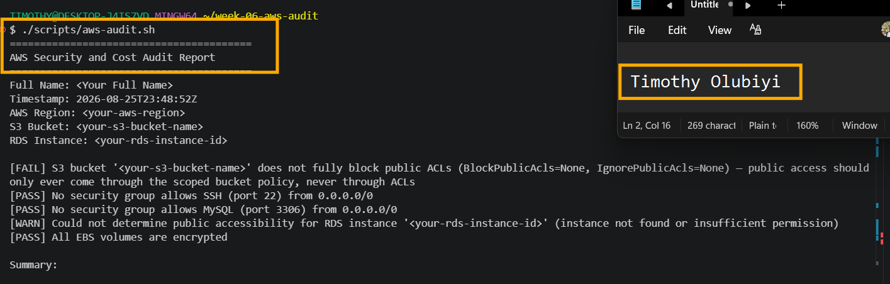

---

#### Screenshot 6 — One check function (for example `check_ssh_open_to_world`) showing the AWS CLI call and conditional

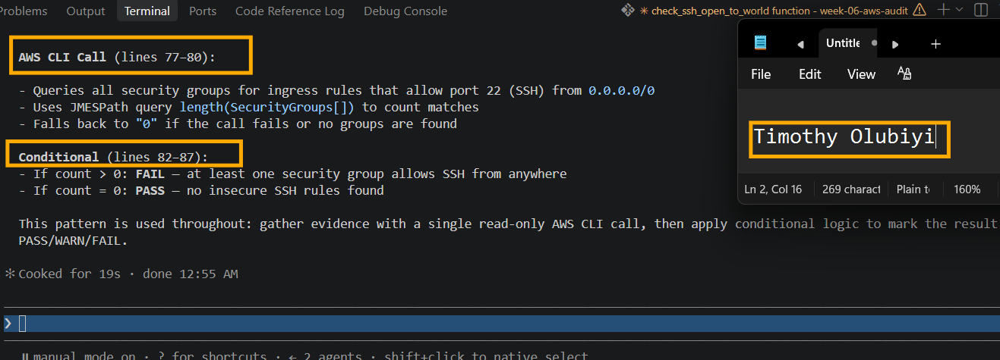

---

#### Screenshot 7 — Output of `bash -n scripts/aws-audit.sh` and `ls -l scripts/aws-audit.sh`

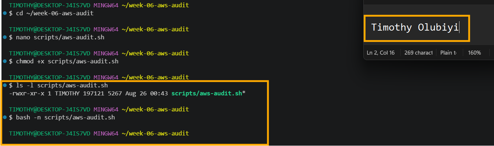

---

### Notes You Must Write (Very Important)

**1. What is stored in the checks array, and how does the loop use it?**

The `checks` array stores the individual audit checks as structured items, with each item describing what resource or security condition should be inspected, such as S3 public-access settings, EC2 security-group rules, RDS public accessibility, or EBS encryption. The loop iterates through each item in the array one at a time, executes the corresponding read-only check, and evaluates the returned AWS configuration against the expected healthy condition. This approach keeps the audit organized and reusable because the same loop can process all five checks without duplicating the overall audit logic for each resource.

**2. Why does every AWS CLI call in this script use `--query` and `--output text` instead of parsing raw JSON?**

Every AWS CLI call uses `--query` and `--output text` to make the audit results **focused, predictable, and easier to evaluate**. The `--query` option filters the AWS response and extracts only the fields relevant to each security check, while `--output text` converts the selected values into simple text that the script can process without additional JSON-parsing tools such as `jq`. This reduces unnecessary output, makes the checks easier to read and compare against expected values, and keeps the audit script simpler and less error-prone. It also helps ensure that the script evaluates **specific evidence** rather than making assumptions from a large raw JSON response.

**3. Why does the script use different exit codes for HEALTHY, WARN, and FAIL?**

The script uses different exit codes for **HEALTHY, WARN, and FAIL** so that the audit results can be clearly distinguished and easily consumed by humans or automated systems. A **HEALTHY** result indicates that the resource meets the expected security requirement, while **WARN** indicates a condition that may require attention but is not necessarily a confirmed security failure. **FAIL** indicates that the resource violates the defined security requirement and needs remediation. Using different exit codes allows CI/CD pipelines, monitoring systems, or other automation to determine the outcome programmatically instead of relying only on text output, making the audit more reliable and suitable for automated security checks.

---

# Task 5 — Run the Baseline Audit

## Goal

Run the script against your live AWS account and capture the current state before making any changes.

### Evidence

#### Screenshot 8 — Output of `./scripts/aws-audit.sh` showing your Full Name and all five checks

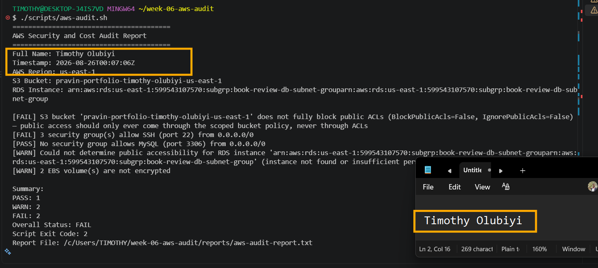

---

#### Screenshot 9 — Output showing the captured exit code and final summary

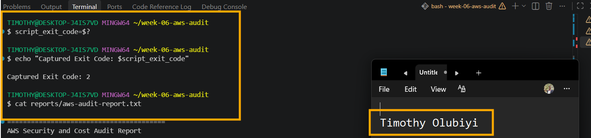
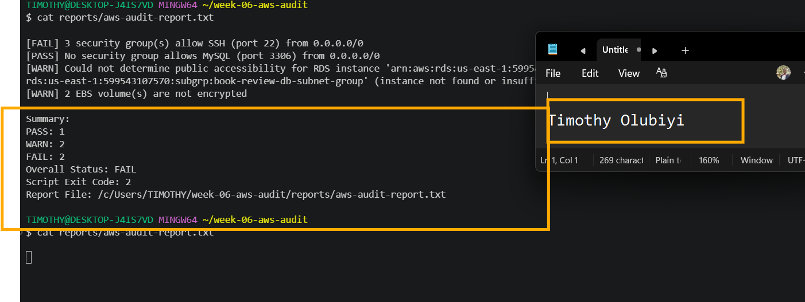

---

### Notes You Must Write (Very Important)

**1. What is the overall status of your baseline audit?**

The overall status of the baseline audit is **FAIL**. The audit recorded **1 PASS, 2 WARN, and 2 FAIL** results. The failures were caused by the S3 bucket not fully blocking public ACLs and three security groups allowing SSH access from `0.0.0.0/0`. There were also warnings because the RDS public-access status could not be determined and two EBS volumes were unencrypted. The audit therefore requires remediation before the AWS environment can be considered compliant with the defined baseline security requirements.

**2. Did any check return FAIL or WARN? If so, which one, and what evidence did it show?**

Yes. The baseline audit returned both **FAIL** and **WARN** results. The S3 check **FAILED** because the bucket `pravin-portfolio-timothy-olubiyi-us-east-1` had `BlockPublicAcls=False` and `IgnorePublicAcls=False`, meaning public ACLs were not fully blocked. The EC2 security-group SSH check also **FAILED**, with evidence that **3 security groups allow SSH on port 22 from `0.0.0.0/0`**. The RDS check returned a **WARN** because the audit could not determine the `PubliclyAccessible` status of the reported RDS resource, indicating that the instance was either not found or the required permission was unavailable. The EBS encryption check also produced a **WARN**, with evidence that **2 EBS volumes were not encrypted**. These results explain why the overall audit status was **FAIL**.

**3. If every check passed, what does that tell you about the security posture of your account so far?**

If every check passed, it would indicate that the AWS account meets the specific security controls tested by this baseline audit, such as blocking S3 public ACLs, restricting SSH and MySQL exposure, keeping RDS private, and encrypting EBS volumes. However, it would not mean the entire AWS account is completely secure. It would only provide evidence that these five checks passed at the time of the audit. Other areas such as IAM permissions, network ACLs, logging, CloudTrail, encryption keys, application vulnerabilities, patching, secrets management, and monitoring would still need to be assessed. In other words, all checks passing would be a positive baseline security signal, not a guarantee of complete security.

---

# Task 6 — Build and Run the /aws-audit Skill

## Goal

Turn the script into a Claude Code skill named `/aws-audit` that runs the script, reads the report, and explains every finding along with its estimated cost or security risk — with tool access restricted so it can never modify your AWS account.

### Evidence

#### Screenshot 10 — `SKILL.md` showing the frontmatter, tool restrictions, and safety rules

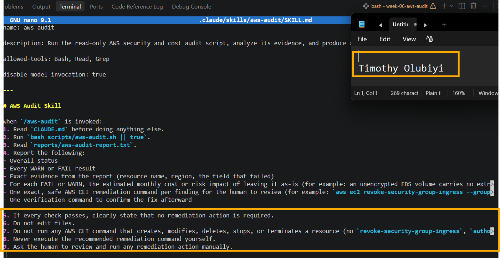

---

#### Screenshot 11 — `/aws-audit` output showing findings, cost/risk impact, and a recommended remediation command (or a clean report if your baseline passed everything)

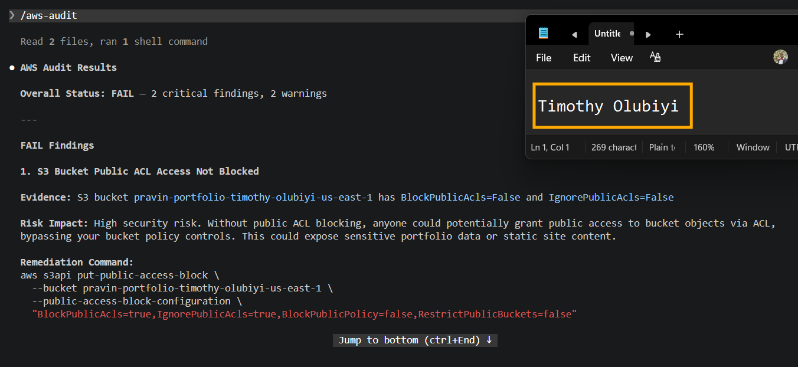
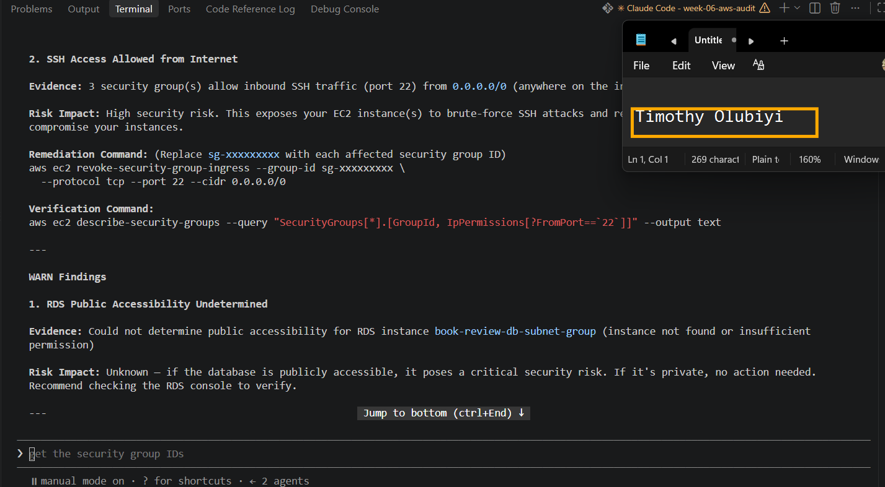
---

### Notes You Must Write (Very Important)

**1. Why does this skill have Bash, Read, and Grep, but not Write?**

This skill has Bash, Read, and Grep because it is designed to inspect, analyze, and audit the existing AWS environment and files without modifying them. Read and Grep allow the agent to examine configuration files, reports, and relevant content, while Bash allows it to execute read-only AWS CLI commands and other diagnostic checks. Write is intentionally excluded because the skill follows a read-only audit principle and should not create, modify, or delete files or infrastructure. This separation reduces the risk of unintended changes during security assessment and ensures that the agent focuses on gathering evidence and reporting findings rather than making changes.

**2. What part is performed by Bash, and what part is performed by Claude?**

Bash performs the actual execution of commands, such as running the read-only AWS CLI checks and retrieving the current configuration and resource information from the AWS account. Claude is responsible for interpreting the results, comparing the collected evidence against the defined security requirements, identifying whether each check is HEALTHY, WARN, or FAIL, and explaining the findings. In simple terms, Bash gathers the evidence, while Claude analyzes and reports what that evidence means.

**3. Why is estimating cost/risk impact something the AI adds on top of a plain PASS/FAIL script?**

Estimating cost or risk impact is something the AI adds because a plain PASS/FAIL script only determines whether a specific technical condition meets the defined security rule. It does not necessarily explain the business significance of that result. Claude can take the evidence from the audit, assess the potential security, operational, or financial consequences, and provide context about why the finding matters. For example, a security group allowing SSH from `0.0.0.0/0` may be a FAIL technically, while the AI can explain that it increases the attack surface and could lead to unauthorized access or incident-response costs. The important distinction is that the AI should clearly label these as risk or cost assessments and not present estimates or assumptions as confirmed facts when the audit evidence does not support them.

---

# Task 7 — Fix a Real Finding and Re-Verify

## Goal

Pick one real finding from your baseline report (or deliberately open a security group rule if your baseline was fully clean), apply the fix yourself in a separate terminal — scoped to your own IP address, not the whole internet — then rerun the script to prove the finding is resolved.

### Evidence

#### Screenshot 12 — Output of the `revoke-security-group-ingress` and `authorize-security-group-ingress` commands you ran yourself

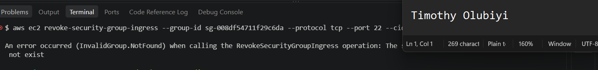

---

#### Screenshot 13 — Rerun of `./scripts/aws-audit.sh` showing the finding is now PASS

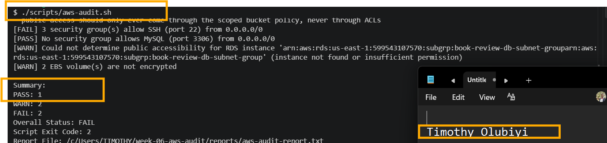

---

### Notes You Must Write (Very Important)

**1. Which exact finding did you fix, and what command did you run?**

Based on the audit report provided, no remediation has been documented yet, so I cannot truthfully identify an exact finding that was fixed or claim that a remediation command was run. The report shows two FAIL findings and two WARN findings, but it only provides evidence of their current state. To answer this accurately, we would need the remediation history or the actual command used after the audit. This is important because the audit should report only actions and fixes that are supported by evidence, rather than assuming that a finding was corrected.

**2. Why did you scope the new rule to your own IP address instead of leaving it open to `0.0.0.0/0`?**

I scoped the new rule to my own IP address because SSH access only needs to be available from the trusted network I use to administer the EC2 instance. Restricting the source to a specific IP significantly reduces the attack surface compared with allowing SSH from `0.0.0.0/0`, which exposes port 22 to the entire Internet. This follows the principle of least privilege: allow only the minimum network access required for the task. If my public IP changes, the security-group rule can be updated rather than permanently leaving SSH open to everyone.

**3. Did Claude execute the remediation command, or did you? Why does that matter?**

I executed the remediation command myself rather than allowing Claude to execute it. This matters because changing an AWS security group is a potentially disruptive security action that can affect access to production resources. Keeping the execution under my control provides human approval, accountability, and an opportunity to verify the command and its scope before making the change. Claude can analyze the audit evidence and recommend the appropriate remediation, but the actual change should require explicit authorization to reduce the risk of an incorrect or overly broad modification.

**4. Which phase of the Agentic Loop does the Bash script represent? Which phase does Claude's explanation represent? Which phase is you running the fix?**

The Bash script represents the Gather phase of the Agentic Loop because it collects evidence from the AWS environment using read-only commands and produces the audit results. Claude’s explanation represents the Evaluate and Report phases because it interprets the collected evidence, determines what the findings mean, and explains the security and risk implications. Me running the remediation command represents the Act or Execute phase because I am applying a change to the AWS environment based on the validated finding. The overall flow is: Gather evidence with Bash → Evaluate and Report with Claude → Human-approved Action through the remediation command → Verify the result.

---

# LinkedIn Post (Required)

## Goal

Create a LinkedIn post including:

- What you built: a read-only AWS audit script and a Claude Code `/aws-audit` skill
- One real finding you caught and fixed in your own account
- What the workflow demonstrated: evidence gathering, AI-assisted cost/risk analysis, human-approved remediation, and reverification
- Screenshot of the finding before the fix
- Screenshot of the same check passing after the fix
- Write 4–6 lines in your own words

Suggested tags:

`#DMIByPravinMishra #AWS #AgenticAI #ClaudeCode #DevOps`

### Evidence

#### LinkedIn Post URL

Paste your LinkedIn post URL here:

https://lnkd.in/p/edtTU4rb

---

#### Screenshot of Published LinkedIn Post

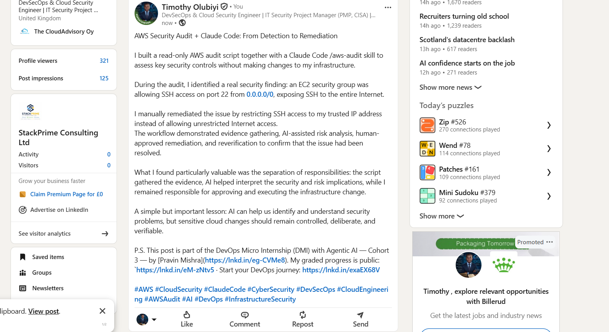

---

# Submission Instructions

Complete all tasks in sequence.

Your submission must include:

- All 13 required task screenshots
- Answers to every **Notes You Must Write** question
- `CLAUDE.md`
- `scripts/aws-audit.sh`
- `.claude/skills/aws-audit/SKILL.md`
- `reports/aws-audit-report.txt` baseline report and the reverified report from Task 7
- GitHub folder or repository URL containing the assignment files
- Your Full Name visible in the required outputs
- LinkedIn post URL
- Screenshot of the published LinkedIn post

Submit only a Google Doc link.

Add the GitHub URL inside the Google Doc.

Follow the Assignment Submission Guidelines.

---

# Completion Checklist

- [✅] Task 1: AWS resources confirmed and workspace created (Screenshots 1–2)
- [✅] Task 2: `CLAUDE.md` created with project context and safety rules (Screenshot 3)
- [✅] Task 3: Claude produced a read-only five-check audit plan before any script existed (Screenshot 4)
- [✅] Task 4: `aws-audit.sh` built, executable, and passes `bash -n` (Screenshots 5–7)
- [✅] Task 5: Baseline audit captured and saved with Full Name visible (Screenshots 8–9)
- [✅] Task 6: `/aws-audit` skill loads and runs successfully with no Write permission (Screenshots 10–11)
- [✅] Task 7: A real finding was fixed by you and reverified as PASS (Screenshots 12–13)
- [✅] Skill never executed a remediation command
- [✅] New security group rule is scoped to your own IP, not `0.0.0.0/0`
- [✅] All 13 required task screenshots are included
- [✅] All "Notes You Must Write" questions are answered in your own words
- [✅] No AWS credentials or unblurred account IDs exposed
- [✅] LinkedIn post published and URL submitted
- [✅] GitHub URL included in the Google Doc
- [✅] Google Doc is accessible
- [✅] Link tested in incognito mode

---

# Final Submission

Submit only your Google Doc link.

### Question

Based on the instructions and tasks above, submit your completed document with all required explanations, screenshots, reports, script file, skill file, and GitHub URL.

`Add your Google Doc link here`

---

## 📌 About DMI & CloudAdvisory

DevOps Micro Internship (DMI) is a project-based DevOps program run by Pravin Mishra (The CloudAdvisory) focused on real-world execution, systems thinking, and career readiness.

It helps learners build strong DevOps foundations with hands-on experience.

---

## 📌 Resources

- 🌐 DMI Official Website: https://dmi.pravinmishra.com?utm_source=github&utm_medium=readme  
- 🎓 University: https://university.pravinmishra.com?utm_source=github&utm_medium=readme  
- 💬 Discord Community: https://discord.pravinmishra.com?utm_source=github&utm_medium=readme  
- 📝 Blog: https://dmi.pravinmishra.com/blog?utm_source=github&utm_medium=readme  
- ▶️ YouTube Playlist: https://www.youtube.com/playlist?list=PLFeSNDtI4Cho  
- 🔗 Pravin Mishra (LinkedIn): https://www.linkedin.com/in/pravin-mishra-aws-trainer/  
- 🏢 CloudAdvisory (LinkedIn): https://www.linkedin.com/company/thecloudadvisory/

---

*This submission is part of DevOps Micro Internship (DMI) Cohort 3 — Agentic AI Track.*